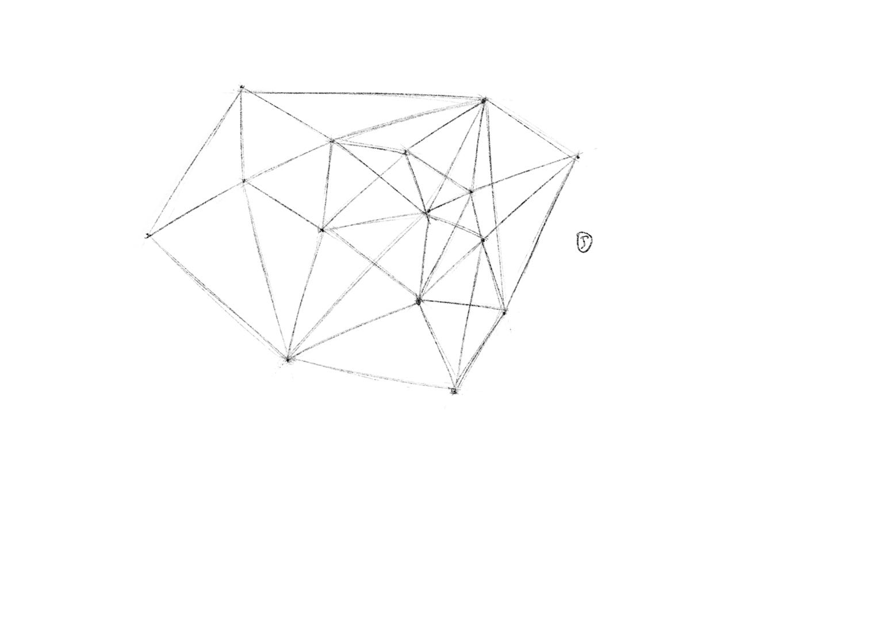
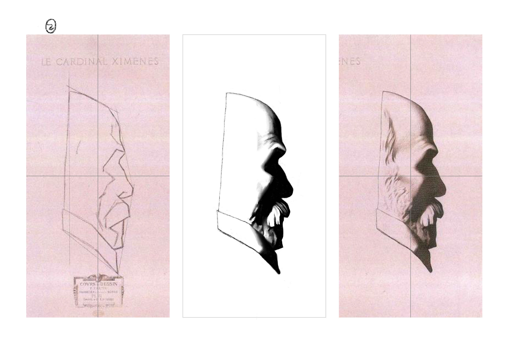
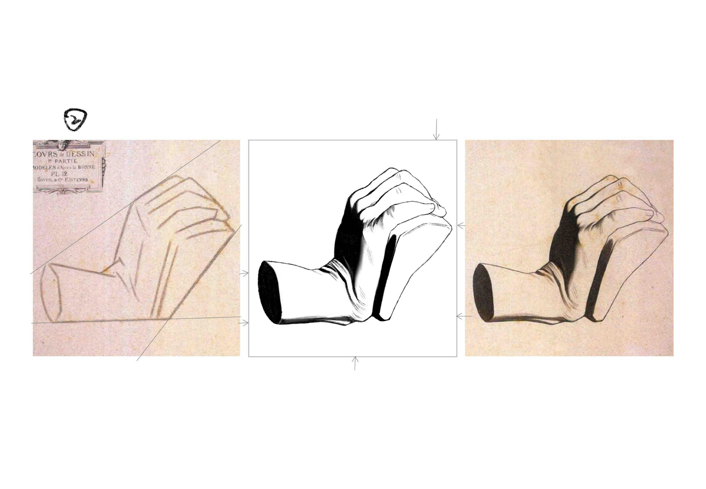
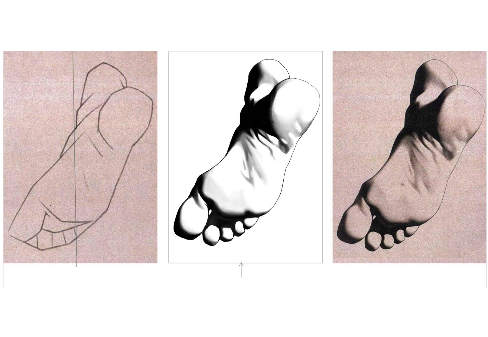

#### 1.点点连线

我用的iPad进行板绘完成了点点连线练习，有种像是用手腕写横竖撇捺的感觉。

#### 2.二分法与网格

这次作业我看完正课后画了一次，第一次画没有注意整体检查；在看完补充内容后， 对整体检查有了体会后，第二次画就更加准确了一些，之后修改了细节就是提交作业的第三个版本。

#### 3.轮廓细化

这次的作业我首先参照了上一次作业的绘画过程，首先找点位进行两点连线，但是由于缺乏经验，在用直线归纳的时候用线过粗；后面绘制曲线一开始对于细节的把握比较困难，通过多次观察渐渐将作业修改得更加准确了。

#### 4.角度判断与涂黑

这次的作业是利用倾斜度进行起形，作业中一开始给出的辅助倾斜线十分有用，我基本上也是边画反复对照辅助的斜线检查；而相对的在一些没有辅助线的地方，如第二张图的鼻子和第三张的图胡子，我则花了更多的时间比照和确认位置以及形状。

#### 5.涂灰

这次作业画耳朵，感觉很多细节比较复杂，在完成右图起形的阶段，我已花了大量时间调节；在完成细化、涂黑和涂灰的步骤中，演示视频中用到了纸笔，我则是在尝试一番后才发现procreate软件也有对应的纸笔功能，就是笔旁边的手指图标，感受上像是撒沙子后再把沙子抹匀。

#### 6.正负形与几何概括

这次作业练习观察正负形关系以及颜色过渡，正负形的观察给我的感受是需要从整体和局部反复对比，而颜色过渡的处理在莫凡老师的指导下也完成得更为自然。

#### 7.三角检测

这次的作业我一开始认为主要的难点在脚趾处，因此在观察绘画时在这部分更加小心仔细，但是却忽视了旁边亮部的距离大小，结果画得窄了，之后绘画观察时应当更耐心细致些。多亏有莫凡老师的指导，我才修改和调整好了这些细节上的不足。

#### 8.比例测量

这次作业起形的思路我依照教程操作，其实感觉难度有点大，总觉得自己有些判断不准，很多地方是在画细节的过程中不断去调整的；在画胡子部分，我是将黑色阴影部分当作画布，利用正负形的思路完成的。

#### 9.涂细节

这次的作业画面左边的胡须细节，我先用炭笔点出我直观上看得明显的一些位置，然后再用铅笔去调整位置和形状，在调整的过程中上下对比周围画过部分的相对位置，尽量保持不会有太大偏移，之后再用橡皮和涂抹工具做好深浅和过渡。而有一些细节在绘画的过程中也没有完全注意到，比如一些部分还是下意识的画得过深，这方面之后的绘画中需要注意。

#### 10.视觉延长线

这次作业我按照视频方法首先观察后完成左边起形稿。在完成右边图像步骤时，我一开始把手指部分画得有些低了，后面自己发现调整后看着就自然了很多。最后就是细节部分的一些过渡和减淡调整，需要较多耐心，不过比起上一课的作业其实工作量要略少一些。

#### 11.毕业作品

这次课我前后花好几周完成，原因是现在做其他事情时间有些紧张，这次的作业左边的参考图给出的延长线十分有用，可以很好的帮助判断。这次的过渡感觉比之前的的处理更加细致，经过莫凡老师提示修改之后终于完成。

#### 12.毕业后作品1

#### 13.毕业后作品2

