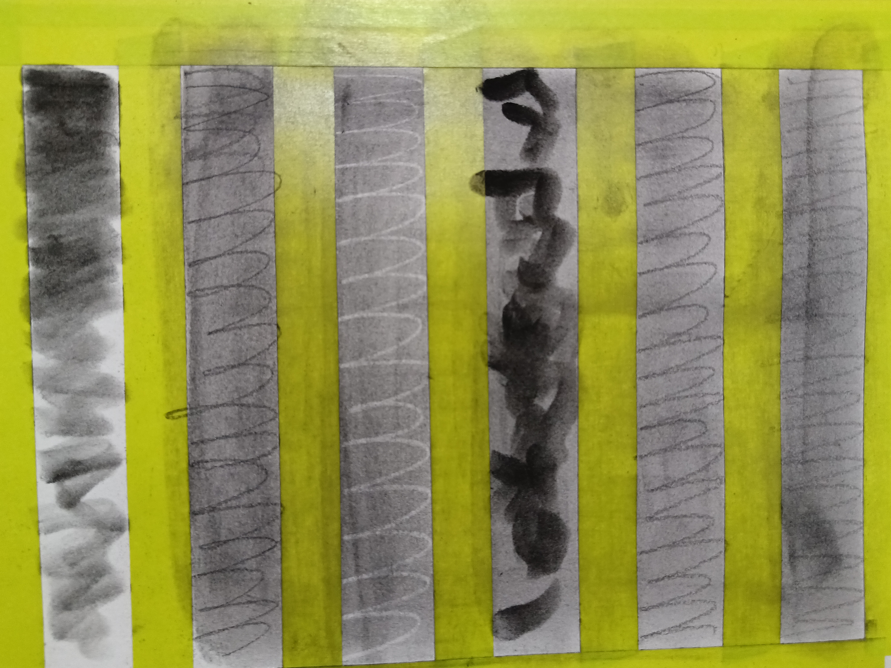
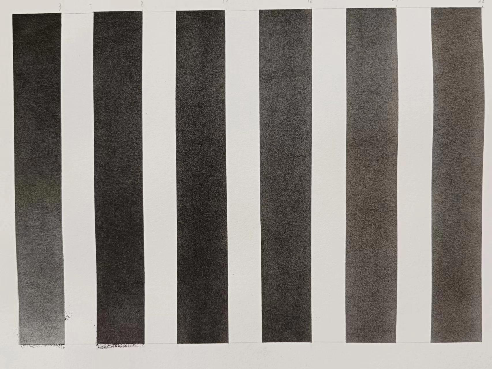

#### 1.涂抹练习

这次作业是对工具的熟悉，我经过尝试希望尽量使颜色均匀，但是总感觉很难达到样图的效果，对于颜色深浅也感觉较难把握，希望通过更多练习后能够慢慢掌握。

#### 2.修改练习
这次的作业，我其实操作了两遍，但是有的地方还是不够熟悉，也是慢慢熟悉工具积累经验的过程。总结而言，对于有瑕疵的地方，觉得浅了可以通过海绵笔粘粉加深遮盖，深了就用眼影棒调整减淡，一些明显深的地方则用高光橡皮轻轻减淡。有的地方我其实肉眼看不太出来，但是用手机摄像头拍一下就会发现不均匀的地方。

