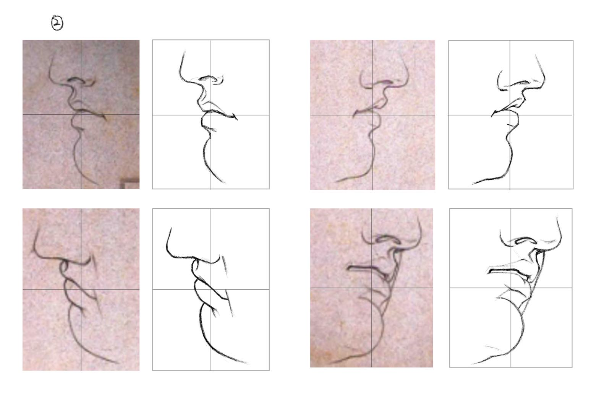
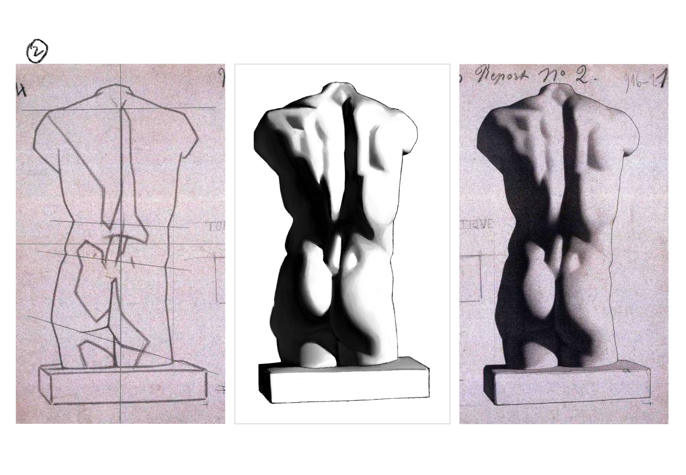
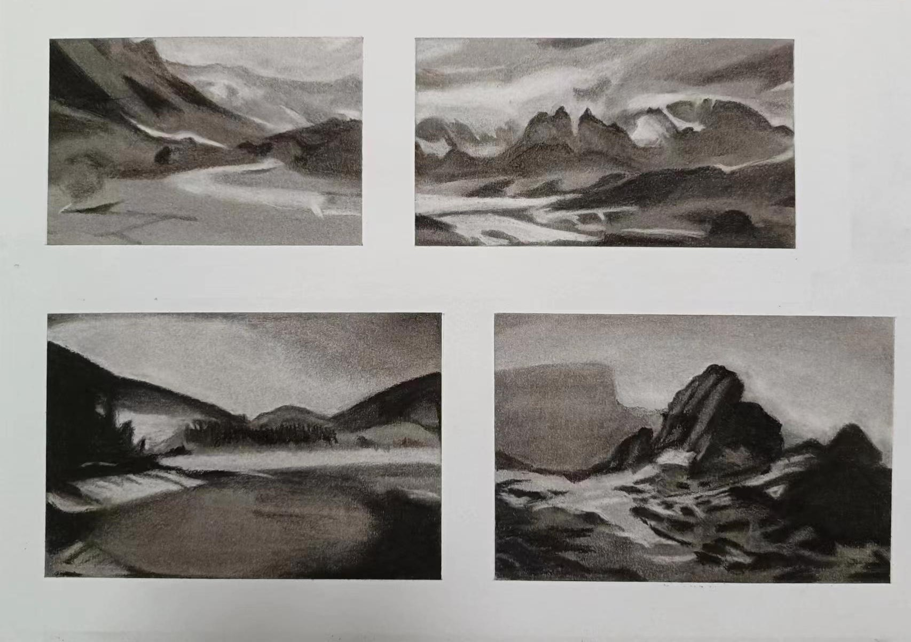
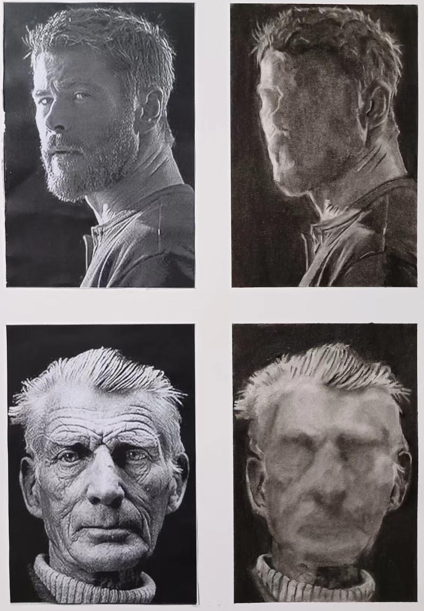

## 绘画学习

学画画，搞个记录吧，反正是修炼心境的。

### ① 绘画基础篇

#### 1.点点连线

我用的iPad进行板绘完成了点点连线练习，有种像是用手腕写横竖撇捺的感觉。

#### 2.二分法与网格

这次作业我看完正课后画了一次，第一次画没有注意整体检查；在看完补充内容后， 对整体检查有了体会后，第二次画就更加准确了一些，之后修改了细节就是提交作业的第三个版本。

#### 3.轮廓细化

这次的作业我首先参照了上一次作业的绘画过程，首先找点位进行两点连线，但是由于缺乏经验，在用直线归纳的时候用线过粗；后面绘制曲线一开始对于细节的把握比较困难，通过多次观察渐渐将作业修改得更加准确了。

#### 4.角度判断与涂黑

这次的作业是利用倾斜度进行起形，作业中一开始给出的辅助倾斜线十分有用，我基本上也是边画反复对照辅助的斜线检查；而相对的在一些没有辅助线的地方，如第二张图的鼻子和第三张的图胡子，我则花了更多的时间比照和确认位置以及形状。

#### 5.涂灰

这次作业画耳朵，感觉很多细节比较复杂，在完成右图起形的阶段，我已花了大量时间调节；在完成细化、涂黑和涂灰的步骤中，演示视频中用到了纸笔，我则是在尝试一番后才发现procreate软件也有对应的纸笔功能，就是笔旁边的手指图标，感受上像是撒沙子后再把沙子抹匀。

#### 6.正负形与几何概括

这次作业练习观察正负形关系以及颜色过渡，正负形的观察给我的感受是需要从整体和局部反复对比，而颜色过渡的处理在莫凡老师的指导下也完成得更为自然。

#### 7.三角检测

这次的作业我一开始认为主要的难点在脚趾处，因此在观察绘画时在这部分更加小心仔细，但是却忽视了旁边亮部的距离大小，结果画得窄了，之后绘画观察时应当更耐心细致些。多亏有莫凡老师的指导，我才修改和调整好了这些细节上的不足。

#### 8.比例测量

这次作业起形的思路我依照教程操作，其实感觉难度有点大，总觉得自己有些判断不准，很多地方是在画细节的过程中不断去调整的；在画胡子部分，我是将黑色阴影部分当作画布，利用正负形的思路完成的。

#### 9.涂细节

这次的作业画面左边的胡须细节，我先用炭笔点出我直观上看得明显的一些位置，然后再用铅笔去调整位置和形状，在调整的过程中上下对比周围画过部分的相对位置，尽量保持不会有太大偏移，之后再用橡皮和涂抹工具做好深浅和过渡。而有一些细节在绘画的过程中也没有完全注意到，比如一些部分还是下意识的画得过深，这方面之后的绘画中需要注意。

#### 10.视觉延长线

这次作业我按照视频方法首先观察后完成左边起形稿。在完成右边图像步骤时，我一开始把手指部分画得有些低了，后面自己发现调整后看着就自然了很多。最后就是细节部分的一些过渡和减淡调整，需要较多耐心，不过比起上一课的作业其实工作量要略少一些。

#### 11.毕业作品

这次课我前后花好几周完成，原因是现在做其他事情时间有些紧张，这次的作业左边的参考图给出的延长线十分有用，可以很好的帮助判断。这次的过渡感觉比之前的的处理更加细致，经过莫凡老师提示修改之后终于完成。

#### 12.毕业后作品1

这次是毕业后的练习，感觉过渡的观察和处理还是存在较大短板。

#### 13.毕业后作品2

毕业后的练习2，正负形的转换还是不太熟悉啊，导致细节上画得总感觉达不到想要的精度。

### ② 色块人像

#### 1.涂抹练习

这次作业是对工具的熟悉，我经过尝试希望尽量使颜色均匀，但是总感觉很难达到样图的效果，对于颜色深浅也感觉较难把握，希望通过更多练习后能够慢慢掌握。

#### 2.修改练习
这次的作业，我其实操作了两遍，但是有的地方还是不够熟悉，也是慢慢熟悉工具积累经验的过程。总结而言，对于有瑕疵的地方，觉得浅了可以通过海绵笔粘粉加深遮盖，深了就用眼影棒调整减淡，一些明显深的地方则用高光橡皮轻轻减淡。有的地方我其实肉眼看不太出来，但是用手机摄像头拍一下就会发现不均匀的地方。

#### 3.擦拭练习
这次的作业我感觉有所困难在于颜色的均匀，确实在画的过程中发现很难将颜色控制均匀，尤其是边缘部分，很难大胆地去涂抹，尝试用纸笔但是效果感觉有限，总觉得有手指涂最均匀；另外有的地方确实不太好擦，总会留下印记，需要耐心一些。最后就是这几天总是下雨，感觉室内有点潮，导致胶带松散了，结果又留下了印渍。

#### 4.五色阶练习
这次作业由于最近比较忙碌，前后花了一两个月才完成，一些心得当时有想到现在忘了实在惭愧。总而言之是要注意大体的关系，提示自己忽视细节，然后相信自己按照方法可以画下去。说实话，面对如此多的细节的确难以把控，我画的过程中也是不断说服自己耐心一点，沉稳一点。

#### 5.质感练习
这次的作业是质感练习，我最大的感悟是不要太拘泥于细节和真实（因为实际上以现在的水平也很难达到），而是分清主次，从大关系上把控画面，达到更好的效果。

#### 6.实战练习
这次作业由于现实生活中有不少事情要做，导致拖了很久完成，一些过程中的心得也有所遗忘。总体而言，我认为自己在细节的打磨上是不足的，这一方面我需要做进一步的尝试，学习和探索。另外则是调整自己的作息安排，尽量稳定的去推进和完成作业。

#### 6_2.风景独立练习

下次应该先看看要求的，我忘记和原图一起拍照就已经将原图撕下了。这次作业和上次用到的知识点相当，我尽量去注意色块分割后利用相应工具处理，但是一些地方还是会注意不到导致细节上不太和谐，大概继续练习会有所改善。

#### 7.人像初体验

从这次开始就是学习人像的绘画了，说实话难度上升不少。一开始我没有分配好思路，凭着感觉作画，导致各个部分画得都不太准确。现在画完感觉这样的尝试大概也很正常，只是用时会更多一些。总结而言，我认为首先要合理地将画面分割，类似于构建多叉树一样，尽管我有意识地这样操作，但随着逐渐疲惫，思路往往会陷于混乱，应该将画面分割为几个色块也逐渐混淆。解决的方法应该是规定一个作画顺序，从边缘开始找特征点，由外到内的推断，逐渐确认不同部分比例关系地去画，之所以从边缘找点，是因为短距离和大关系更容易去判断和调整。

#### 8.正负型练习

这次作业感觉能够犹疑逐渐减少就能够画得更轻松一些.

#### 9.简单模型练习

这次的作业总的来说是上一次作业的延续，先画正负形，然后找面部的点位，连起来构成几个大的平面。这些点位其实是人脸骨骼上凸起来的部分，比如眉弓骨、颧结节、颏结节等一共14个点。看起来也不多而且还是对称的，应该挺好定位的，实际上而言由于不熟悉也不太容易。原因是这些点的位置其实不一定是色块边缘的位置，而是需要根据结构去分析抽象推断出的位置。

#### 10.简单模型练习

这次作业是面部模型的细化，对于五官的细化还是需要进一步的体会。其实更多是关注不同区域的位置相对关系，具体细化还是画不来。

#### 11.眼睛结构练习

这次作业是体会眼睛结构的画法，眼睛的结构也是相当复杂啊，有一些皮肤挤压出的细小的面不好刻画。

#### 12.鼻子质感练习

关于鼻子的质感练习，鼻子的结构相对简单，但是皮肤的机理还是不容易掌握。

#### 13.嘴巴质感练习

嘴巴质感练习，感觉这一课画得最为艰难，算是对色块画法的综合应用，反复对比观察更是对体力的极大考验，好在坚持下来了。

